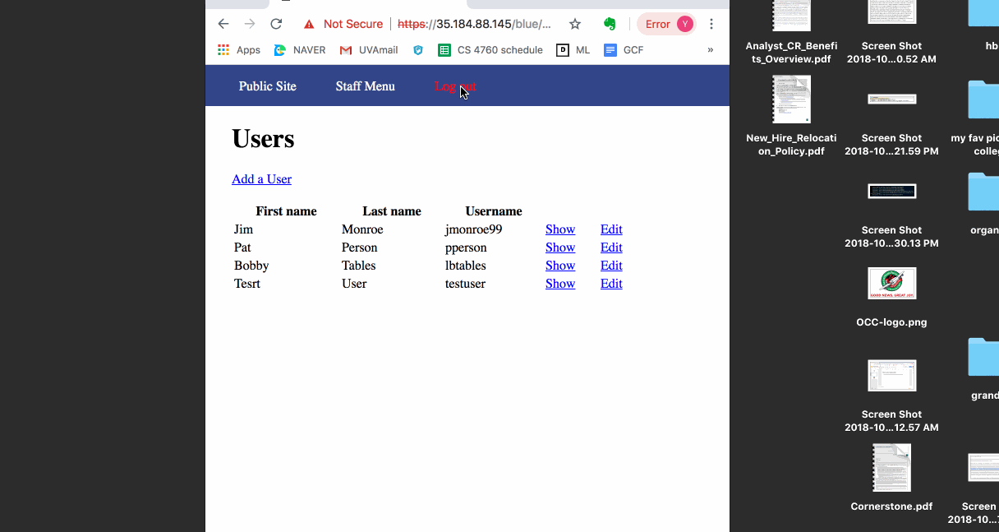
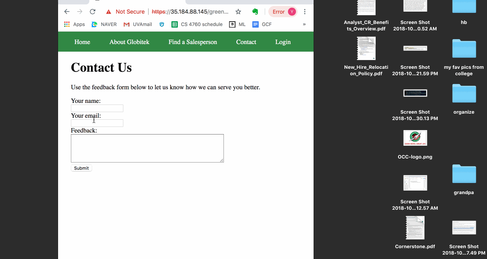
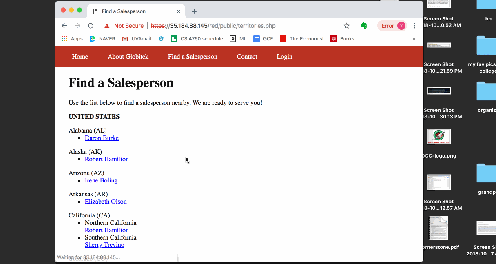
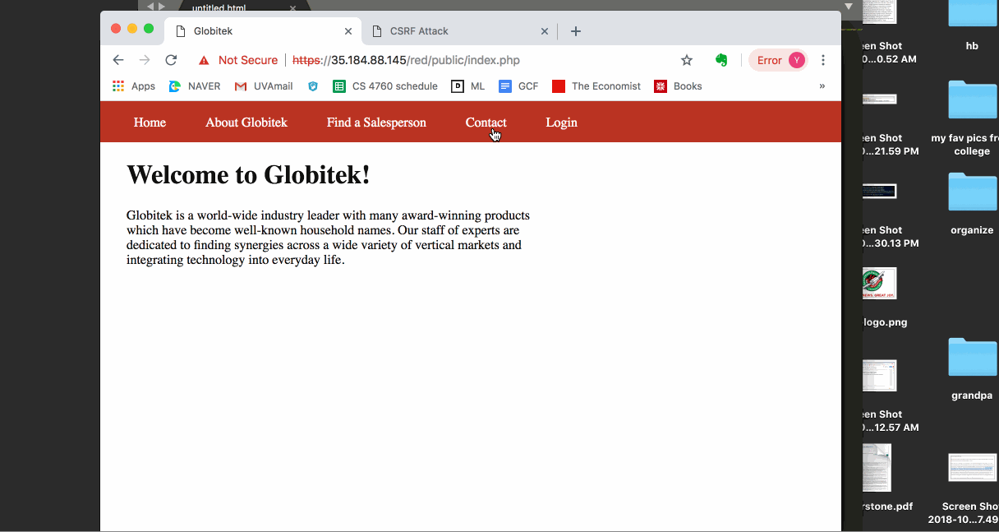

# Project 8 - Pentesting Live Targets

Time spent: **3** hours spent in total

> Objective: Identify vulnerabilities in three different versions of the Globitek website: blue, green, and red.

The six possible exploits are:
* Username Enumeration
* Insecure Direct Object Reference (IDOR)
* SQL Injection (SQLi)
* Cross-Site Scripting (XSS)
* Cross-Site Request Forgery (CSRF)
* Session Hijacking/Fixation

Each version of the site has been given two of the six vulnerabilities. (In other words, all six of the exploits should be assignable to one of the sites.)

## Blue

Vulnerability #1: SQLi

Vulnerability #2: Session Hijacking/Fixation

## Green

Vulnerability #1: Username Enumeration

Vulnerability #2: XSS

## Red

Vulnerability #1: IDOR

Vulnerability #2: CSRF

## Notes

Because we are looking to exploit vulnerabilities on the same websites as our classmates, changes they made to the website would affect us as well, which made things difficult at times.
